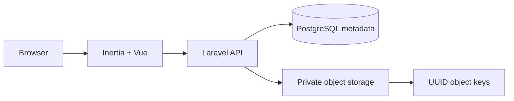

# Digital Library

[](https://github.com/dedyibrahim/digital_library/actions/workflows/ci.yml)

Digital Library adalah aplikasi penyimpanan dan pengelolaan file berbasis web dengan pengalaman seperti Google Drive. File disimpan melalui object storage internal menggunakan object key UUID, sedangkan metadata dikelola di PostgreSQL.

## Fitur

- Autentikasi pengguna: registrasi, login, profil, dan logout.
- Upload satu atau banyak file melalui file picker atau drag-and-drop.
- Mendukung semua jenis file hingga 100 MB per file.
- Folder/kategori untuk mengelompokkan file.
- Pencarian berdasarkan nama file, pemilik, MIME type, dan folder.
- Tampilan grid dan daftar.
- Filter file terbaru dan berbintang.
- Preview mengambang hampir fullscreen seperti Google Drive.
- Thumbnail otomatis untuk gambar, halaman pertama PDF, dan frame video.
- Ikon berwarna berdasarkan ekstensi untuk Office, arsip, audio, video, kode, dan format lainnya.
- Preview langsung untuk PDF, gambar, video, audio, dan teks.
- Download dan penghapusan file.
- Object storage privat dengan URL UUID `/drive/files/{uuid}`.

## Teknologi

- PHP 8.3 dan Laravel 13
- Inertia.js 2 dan Vue 3
- PostgreSQL
- Tailwind CSS
- PDF.js
- Vite
- PHPUnit

## Arsitektur penyimpanan

Object storage internal menyimpan file menggunakan key yang tidak mengungkap nama atau struktur folder pengguna:

```text
objects/library/{prefix}/{uuid}.{extension}
```

Metadata seperti UUID, bucket, object key, nama asli, MIME type, ukuran, folder, status bintang, dan waktu terakhir dibuka tersimpan di PostgreSQL. Semua endpoint file dilindungi autentikasi.



## Struktur utama

```text
app/Services/ObjectStorage.php          Object storage internal
app/Http/Controllers/CatalogController.php
resources/js/Pages/Catalog/Index.vue    Antarmuka drive dan preview
resources/js/Components/FileThumbnail.vue
database/migrations/                    Skema PostgreSQL
tests/Feature/                          Test integrasi
```

## Instalasi

Persyaratan:

- PHP 8.3+
- Composer
- Node.js dan npm
- PostgreSQL

Jalankan:

```bash
composer install
npm install
cp .env.example .env
php artisan key:generate
```

Buat database PostgreSQL bernama `digital_library`, kemudian sesuaikan konfigurasi berikut pada `.env`:

```dotenv
DB_CONNECTION=pgsql
DB_HOST=127.0.0.1
DB_PORT=5432
DB_DATABASE=digital_library
DB_USERNAME=postgres
DB_PASSWORD=your-password
```

Siapkan database dan aset:

```bash
php artisan migrate --seed
npm run build
```

Jalankan aplikasi:

```bash
php artisan serve
```

Buka `http://127.0.0.1:8000`.

## Akun demo

```text
Email: admin@pustaka.test
Password: password
```

Ganti kredensial demo sebelum digunakan di lingkungan production.

## Pengembangan

Untuk menjalankan Laravel dan Vite secara bersamaan:

```bash
composer run dev
```

## Aplikasi desktop Windows

Source aplikasi tersedia di `desktop/` (Electron). Aplikasi harus login dengan akun
Pustaka Digital sebelum folder dapat disinkronkan. File desktop tampil pada folder
**Desktop Sync** di web dan hanya dapat diakses pemiliknya; tautan berbagi yang dibuat
pemilik tetap dapat digunakan penerima sesuai masa berlakunya.

```powershell
php artisan migrate
cd desktop
npm.cmd ci
npm.cmd test
npm.cmd start
npm.cmd run dist
```

Installer: `desktop/dist/Pustaka-Desktop-Setup-1.0.0.exe`. Hasil build tidak disimpan
di Git. Jalankan installer lalu isi alamat server, email, dan password. Pilih folder
khusus dan klik **Mulai sinkronisasi**. Server Laravel harus tetap berjalan.
`http://127.0.0.1:8000` hanya sesuai jika server dan desktop ada di komputer yang sama;
komputer lain memerlukan server HTTPS yang dapat dijangkau.

- Sinkronisasi file baru/perubahan dua arah dalam pasangan folder desktop yang sama,
  diperiksa setiap 15 detik. File upload web biasa belum otomatis masuk pasangan ini.
- Ukuran maksimum 100 MB per file; server PHP/proxy harus mengizinkan ukuran tersebut.
- Checksum SHA-256 mencegah upload berulang; API menggunakan version check untuk
  menolak penimpaan saat versi server berubah. Versi bentrok disimpan sebagai file lain.
- Mode salinan aman: penghapusan tidak diteruskan. File yang hilang di satu sisi
  disalin kembali dari sisi lainnya pada sinkronisasi berikutnya.
- Folder bertingkat dipertahankan melalui path relatif. Folder kosong, rename dari web,
  virtual drive / Files On-Demand, dan sinkronisasi pasangan yang sama lintas komputer
  belum tersedia. Web menampilkan file dalam kategori Desktop Sync secara datar.
- Link/junction, `.git`, `node_modules`, serta file sementara tertentu dilewati.
- Tray, jeda/lanjut, aktivitas transfer, pilihan startup Windows, dan percobaan ulang
  setelah offline tersedia. Password tidak disimpan; token 30 hari dienkripsi oleh
  penyimpanan kredensial OS melalui Electron safeStorage. Logout mencabut token perangkat.
- Logo executable, taskbar, tray, dan installer berasal dari SVG logo aplikasi web.
  Progress total berdasarkan jumlah file yang harus disinkronkan, termasuk progress
  transfer file aktif; 100% memerlukan respons server dan checksum yang cocok.
- Folder pilihan di Windows Explorer menggunakan ikon Pustaka dengan status: centang
  hijau (tersinkron), biru (proses), kuning (jeda), atau merah (error/file dilewati).
  Ini merupakan ikon folder pilihan melalui `desktop.ini`, bukan overlay per-file
  atau kolom Status dari integrasi Windows Cloud Files. Ikon Explorer kadang memerlukan
  refresh F5. `desktop.ini` kustom yang sudah ada tidak ditimpa.
- Installer pengembangan belum ditandatangani sertifikat penerbit, sehingga Windows
  dapat menampilkan peringatan penerbit tidak dikenal.

Implementasi autentikasi mengikuti [Laravel Sanctum](https://laravel.com/docs/13.x/sanctum),
dan pemisahan proses desktop mengikuti [panduan keamanan Electron](https://www.electronjs.org/docs/latest/tutorial/security).

## Pengujian aplikasi web

```bash
php artisan test
npm run build
```

Test mencakup autentikasi, dashboard, pencarian, folder, upload multi-file, object storage, preview, download, bintang, validasi, kompatibilitas route lama, dan penghapusan file.

## Konvensi commit

Proyek menggunakan [Conventional Commits](https://www.conventionalcommits.org/):

```text
feat: menambahkan fitur baru
fix: memperbaiki bug
docs: memperbarui dokumentasi
test: menambahkan atau memperbarui test
refactor: merapikan kode tanpa mengubah perilaku
chore: perubahan tooling atau pemeliharaan
```

## Keamanan

- Jangan commit file `.env`.
- File tersimpan pada disk privat dan tidak diekspos melalui `public/storage`.
- Akses preview, download, upload, serta penghapusan membutuhkan autentikasi.
- Validasi ukuran dilakukan pada frontend dan backend.

## Lisensi

MIT
